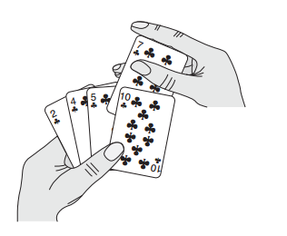
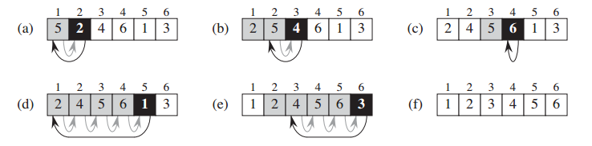

## Insertion sort

Insertion sort is an efficient algorithm for sorting a small
number of elements. Insertion sort works the way many people sort a hand of
playing cards. We start with an empty left hand and the cards face down on the
table. We then remove one card at a time from the table and insert it into the
correct position in the left hand. To find the correct position for a card, we compare
it with each of the cards already in the hand, from right to left. At all times,
the cards held in the left hand are sorted, and these cards were originally the 
top cards of the pile on the table.





The operation of INSERTION-SORT on the array A = {5, 2, 4, 6, 1, 3}. Array indices
appear above the rectangles, and values stored in the array positions appear within the rectangles.

```java
public void insertionSort(int[] A) {
    for (int j = 1; j < A.length; j++) {
        int key = A[j];
        int i = j - 1;
        while (i >= 0 && A[i] > key) {
            A[i + 1] = A[i];
            i--;
        }
        A[i + 1] = key;
    }
}
```

The index j indicates the "current card" being inserted into the hand. At the beginning
of each iteration of the for loop, which is indexed by j, the subarray consisting
of elements A[0...j-1] constitutes the currently sorted hand, and the remaining
subarray A[j+1...n-1] corresponds to the pile of cards still on the table. In fact,
elements A[0...j-1] are the elements originally in positions 0 through j-1, but
now in sorted order.

We state these properties of A[0...j-1] formally as a loop invariant:

>At the start of each iteration of the for loop, the subarray A[0...j-1]
consists of the elements originally in A[0...j-1], but in sorted order.

We use loop invariants to help us understand why an algorithm is correct. We
must show three things about a loop invariant:

* **Initialization**: It is true prior to the first iteration of the loop.
* **Maintenance**: If it is true before an iteration of the loop, it remains true before the
next iteration.
* **Termination**: When the loop terminates, the invariant gives us a useful property
that helps show that the algorithm is correct.

When the first two properties hold, the loop invariant is true prior to every iteration
of the loop. (Of course, we are free to use established facts other than the loop
invariant itself to prove that the loop invariant remains true before each iteration.)
Note the similarity to mathematical induction, where to prove that a property holds,
you prove a base case and an inductive step. Here, showing that the invariant holds
before the first iteration corresponds to the base case, and showing that the invariant
holds from iteration to iteration corresponds to the inductive step.

The third property is perhaps the most important one, since we are using the loop
invariant to show correctness. Typically, we use the loop invariant along with the
condition that caused the loop to terminate. The termination property differs from
how we usually use mathematical induction, in which we apply the inductive step
infinitely; here, we stop the “induction” when the loop terminates.
Let us see how these properties hold for insertion sort.

* **Initialization**: We start by showing that the loop invariant holds before the first
loop iteration, when j = 1. The subarray A[0...j-1], therefore, consists
of just the single element A[0], which is in fact the original element in A[0].
Moreover, this subarray is sorted (trivially, of course), which shows that the
loop invariant holds prior to the first iteration of the loop.

* **Maintenance**: Next, we tackle the second property: showing that each iteration
maintains the loop invariant. Informally, the body of the for loop works by
moving A[j-1], A[j-2], A[j-3], and so on by one position to the right
until it finds the proper position for A[j], at which point it inserts
the value of A[j]. The subarray A[0...j] then consists of the elements
originally in A[0...j], but in sorted order. Incrementing j for the next iteration
of the for loop then preserves the loop invariant.

* **Termination**: Finally, we examine what happens when the loop terminates. The
condition causing the for loop to terminate is that j == A.length = n. Because
each loop iteration increases j by 1, we must have j == n at that time.
Substituting n for j in the wording of loop invariant, we have that the
subarray A[0...n-1] consists of the elements originally in A[0...n-1], but in sorted
order. Observing that the subarray A[0...n-1] is the entire array, we conclude that
the entire array is sorted. Hence, the algorithm is correct.

We shall use this method of loop invariants to show correctness later in other for loops as well.

Below is the recursive version.

```java
public void recursiveInsertionSort(int[] A, int n) {
    if (n > 0) {
        recursiveInsertionSort(A, n - 1);
        int key = A[n];
        int i = n - 1;
        while (i >= 0 && A[i] > key) {
            A[i + 1] = A[i];
            i--;
        }
        A[i + 1] = key;
    }
}
```
